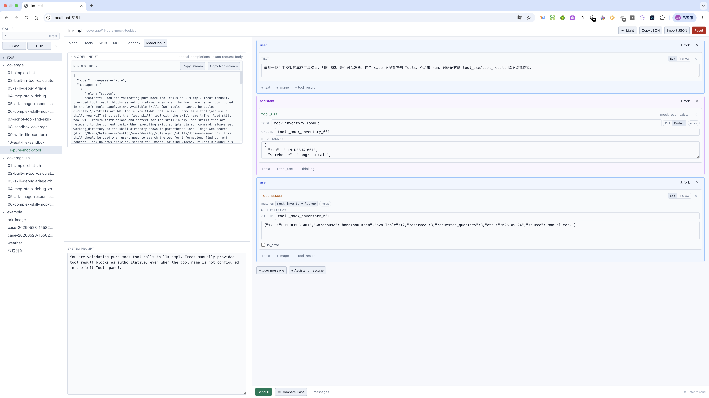
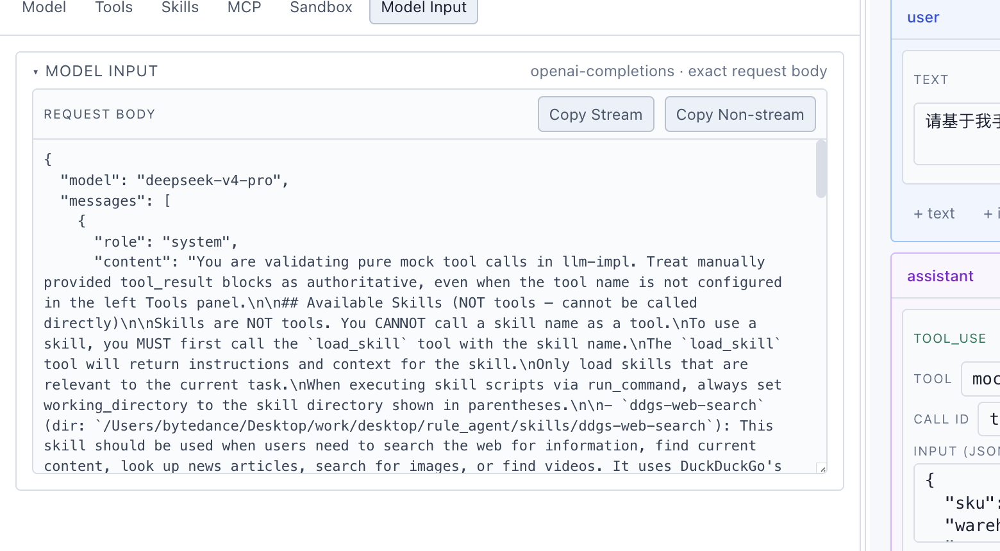

# llm-impl

一个用于**调试 LLM 对话流**的本地工具：让你可以介入 agent loop 的每一步——
篡改任意一条 assistant 消息、改 tool_use 的参数、手填 tool_result，
然后让模型基于"你改后的历史"继续。

支持 9 个上游 provider、24 个模型（OpenAI / Anthropic 协议），
NDJSON 流式输出，reasoning 思考块抽取，工具白名单真执行，
多模型并排对比。



## 你可以用它做什么

- **断点式调试对话历史**：任意插入、修改、删除 `user` / `assistant` 消息和 content block。
- **纯模拟工具调用**：手工写 `tool_use` / `tool_result`，不需要真实工具实现也能测 agent 分支。
- **真执行白名单工具**：对可信内置工具显示 `run` 按钮，执行结果自动回填到 `tool_result`。
- **复制可运行 cURL**：在 Model Input 里复制带本地 provider key 的请求，支持流式和非流式两种模式。
- **多模型并排回放**：Compare 会用同一份历史同时跑两个 provider/model，观察输出、latency、thinking 差异。

## cURL 调试

Model Input 面板展示当前 provider/model 的 exact request body，并提供两个复制入口：

- `Copy Stream`：复制和主调试区 `Send` / `Compare` 一致的流式请求。
- `Copy Non-stream`：复制一次性 JSON 响应请求，适合在终端里快速看完整结果。

生成 cURL 时会由本地 server 读取 `config/providers.json` 里的真实 `apiKey`，
并按目标协议生成 endpoint / headers / body：



## 文档

按顺序读：

| # | 文档 | 内容 |
|---|---|---|
| 00 | [介绍](docs/00-intro.md) | 它是什么、解决什么问题、与 Playground 的区别 |
| 01 | [快速开始](docs/01-quickstart.md) | 装 Bun、配置 keys、起服务、发第一条消息 |
| 02 | [Providers 与模型](docs/02-providers.md) | `config/providers.json` 结构，添加自定义 provider |
| 03 | [核心调试工作流](docs/03-workflow.md) | 三栏布局，消息/Block 编辑，Send / Fork / Continue |
| 04 | [流式与推理思考](docs/04-streaming-reasoning.md) | 流式事件协议，thinking 块如何流出 |
| 05 | [工具调用与真执行](docs/05-tools.md) | 定义 tools schema，手填 vs ▶ run 真跑 |
| 06 | [用例与持久化](docs/06-cases-and-state.md) | Cases 文件树，workspace 自动保存，Copy/Import JSON |
| 07 | [多模型对比](docs/07-compare.md) | Compare modal 用法，并排 diff |
| 08 | [架构与扩展](docs/08-architecture.md) | 目录结构、协议适配器、扩展工具/provider/协议 |
| 09 | [Debug SDK](docs/09-debug-sdk.md) | 外部 agent run 导入、Live Debug 断点、constraints 协议 |
| 10 | [LangChain / LangGraph Adapter](docs/10-langchain-langgraph-adapter.md) | 官方 adapter、工具包装、回调采集、LangGraph interrupt 模式 |

外部框架接入示例见 [examples](examples/README.md)，其中包含 LangChain
callback trace、LangChain live tools、LangGraph ToolNode 和 LangGraph
interrupt/resume 四种模式。

AI 助手可使用项目内 [skills](skills/README.md) 读取 SDK 接入说明；skill
通过引用同一份 `docs/` 和 package README 保持同步。

## 启动一句话

```bash
cp config/providers.example.json config/providers.json
# 编辑 providers.json 填上你的 baseUrl + apiKey
bun install
bun run dev
# → http://localhost:5181
```
